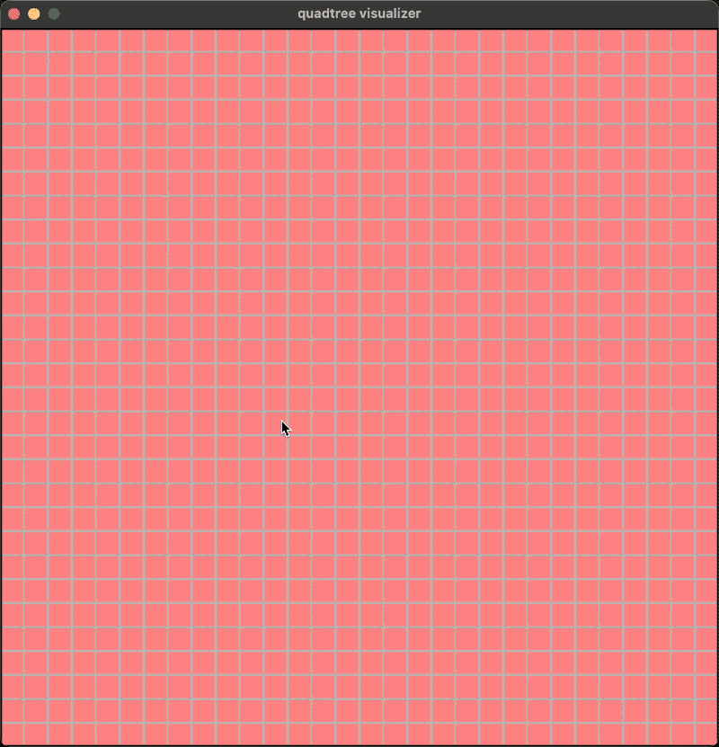
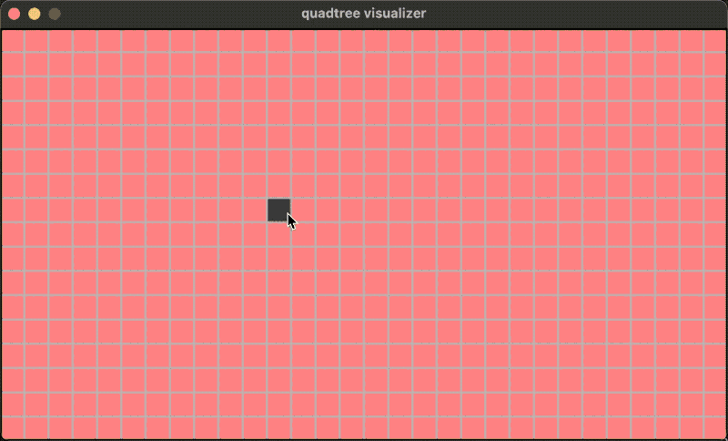

quadtree.hpp
============

A quadtree implementation working on a grid rectangle region in C++.

## Features

* The tree structure can be adjusted dynamically and incrementally.
* Working both on square and non-square rectangle grids.
* Time complexity finding a node is `log(Depth)` via binary-search on depth.

## Screenshots


| <!-- -->                                           | <!-- -->                                                    |
| -------------------------------------------------- | ----------------------------------------------------------- |
| Square:        | Rectangle:           |


中文博客: https://writings.sh/post/quadtree

## Installation

Copy away `quadtree.hpp`.

Requirements: `>=C++17`

### Usage

```cpp
// Suppose this is the type of objects to manage.
struct Object {...};

// Creates a function, it stops to split the leaf node when:
// 1. its width and height are both not larger than 2.
// 2. or the number of managed objects not larger than 3.
quadtree::SplitingStopper ssf = [](int w, int h, int n) {
  return (w <= 2 && h <= 2) || (n <= 3);
};

// Creates a tree on a 30x30 grid region.
quadtree::Quadtree<Object*> tree(30, 30, ssf);

// Build the tree.
tree.Build();

// Add a pointer to object obj1 locates at position (3,4)
tree.Add(3, 4, obj1);

// Remove the pointer to object obj1 locates at position (3,4)
tree.Add(3, 4, obj1);

// Query the objects inside rectangle [(x1,y1), (x2,y2)]
tree.QueryRange(x1, y1, x2, y2, [](int x, int y, Object* o) {
  // Handle object o locating at position (x, y)
});

// Visit every leaf node.
tree.ForEachNode([](quadtree::Node<Object*>* node) {
  if (node->isLeaf) {
    // if node is a leaf, visit its objects
    for (auto [x, y, o]: node->objects) {
      // for every object inside this leaf node,
      // the object o locates at position (x,y)
    }
  }
});
```

### How to run the visualizer

1. Enter the directory [visualizer](visualizer)

   ```bash
   cd visualizer
   ```

2. Make sure [conan](https://conan.io/) has been installed, then install the requirements (SDL etc.):

   ```bash
   make install
   ```

3. Build:

   ```bash
   make cmake
   make build
   ```

4. Run the program on a `30x30` grid region:

   ```bash
   ./build/quadtree-visualizer -w 30 -h 30
   ```

Visualizer's operations:

1. Click the **left mouse button** to add or remove objects.
2. Click the **right mouse button** to figure the left-upper corner of the query region,
   and then right click again to figure the right-botton corner to query the objects that inside this rectangle region.
3. `ESC` or `Ctrl-C` to quit.


### License

BSD
